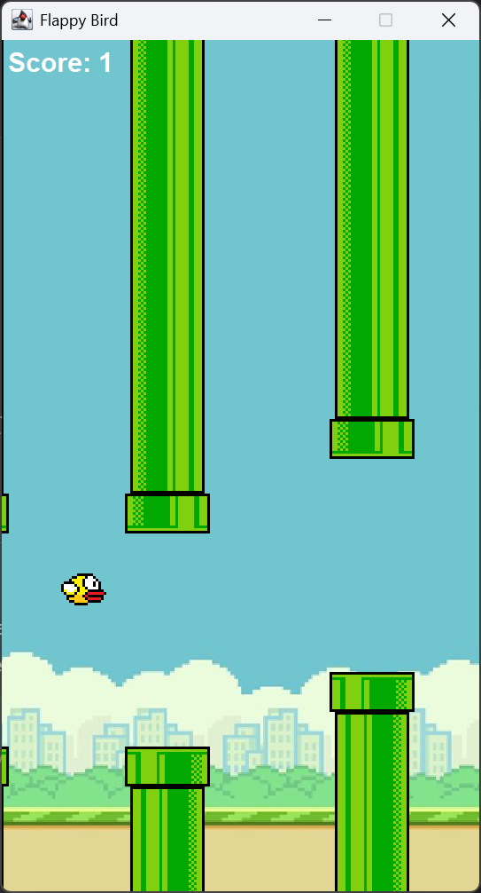

# TP6DPBO2025C1

## Janji
_Saya, **Hafsah Hamidah** dengan NIM **2311474**, mengerjakan **Tugas Praktikum 6** dalam mata kuliah **DPBO** dengan sebaik-baiknya demi keberkahan-Nya.  
Saya berjanji tidak melakukan kecurangan sebagaimana yang telah dispesifikasikan. **Aamiin.**_

## Deskripsi Program

Program ini adalah permainan **Flappy Bird** yang dibangun menggunakan **Java Swing**. Pemain mengendalikan burung yang terus terbang dan harus menghindari pipa yang muncul dari sisi kanan layar. Tujuan dari permainan ini adalah untuk bertahan hidup selama mungkin dengan menghindari pipa yang datang dan mengumpulkan skor. Program ini mencakup berbagai komponen grafis untuk menampilkan burung, pipa, latar belakang, serta kontrol untuk memulai dan mengakhiri permainan.

### Fitur utama:
1. **Menu Awal**: Menampilkan menu dengan tombol **Play** untuk memulai permainan.
2. **Permainan Flappy Bird**: Pemain mengendalikan burung untuk menghindari pipa.
3. **Skor**: Skor dihitung berdasarkan jumlah pipa yang berhasil dilewati oleh burung.
4. **Kontrol Keyboard**: Pemain dapat menekan tombol **space** untuk membuat burung terbang dan **R** untuk memulai ulang permainan setelah game over.
5. **Grafis dan Animasi**: Menampilkan animasi burung yang terbang dan pipa yang bergerak dari kanan ke kiri.

## Alur Program

**Start Menu**:
- Program dimulai dengan menampilkan jendela menu yang berisi gambar latar belakang dan tombol **Play**.
- Ketika tombol **Play** ditekan, permainan dimulai dan burung muncul di layar.

**Permainan**:
- Pemain mengendalikan burung yang secara otomatis jatuh dan dapat diterbangkan dengan menekan tombol **space**.
- Pipa bergerak dari kanan ke kiri, dan pemain harus menghindari pipa dengan menjaga posisi burung.
- Skor bertambah setiap kali burung berhasil melewati pipa.

**Game Over**:
- Permainan berakhir jika burung menabrak pipa atau jatuh ke dasar layar.
- Setelah game over, pemain dapat menekan tombol **R** untuk memulai ulang permainan.

### 3. Komponen GUI
- **JButton**: Digunakan untuk tombol **Play** di menu awal.
- **JLabel**: Menampilkan skor saat permainan berlangsung.
- **JPanel**: Digunakan untuk menggambar game, termasuk burung, pipa, dan latar belakang.
- **JFrame**: Membuat jendela utama untuk permainan dan menu.
- **KeyListener**: Mengatur kontrol permainan menggunakan keyboard.

## Penjelasan Kelas

### 1. **App.java**
Kelas ini adalah titik masuk dari program. Ketika program dijalankan, **StartMenu** akan ditampilkan terlebih dahulu. Program akan membuat objek **StartMenu** yang berisi tombol untuk memulai permainan.

### 2. **StartMenu.java**
Kelas ini mengelola tampilan menu awal permainan. Menu ini terdiri dari gambar latar belakang dan tombol **Play**. Ketika tombol **Play** ditekan, program akan membuka jendela permainan dan menutup menu.

### 3. **FlappyBird.java**
Kelas ini mengelola logika permainan. Di dalam kelas ini, kita mengatur gerakan burung, pipa, dan interaksi dengan pemain. Kelas ini juga mengatur permainan berakhir dan menghitung skor.

### 4. **Player.java**
Kelas ini mengelola atribut dan gerakan burung. Burung memiliki posisi, ukuran, dan kecepatan vertikal yang dapat diperbarui selama permainan.

### 5. **Pipe.java**
Kelas ini mengelola atribut pipa, termasuk posisi dan gerakan. Pipa bergerak dari kanan ke kiri dan muncul secara acak di layar.

## Dokumentasi

**Screenshot Tampilan Program**:
| Start | Play | Game Over |
|---|---|---|
|  |  |  |

**Video Rekaman Layar**:

https://github.com/user-attachments/assets/4784a11b-05db-48b4-8e7b-8c53eb943cc7

